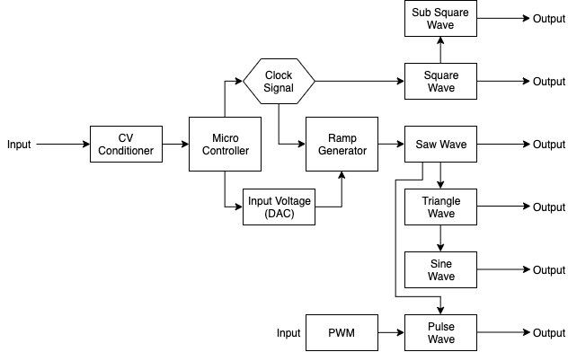
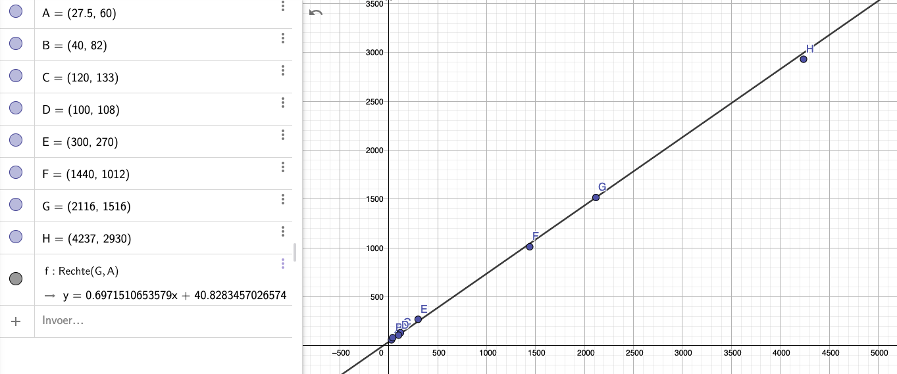

# Vulcan DCO

## Status: Work in Progress

- done: draw first schematic
- done: breadboard and test
- todo: board design
- todo: design frontpanel
- todo: order PCB and build prototype

## Theory

This DCO module is based on an article written by Alethea Flowers about the Roland Juno series. 
The idea behind this specific DCO is that a (analog) ramp generator is being controlled by 
a (digital) microcontroller. A clock signal comming from the micro controller will control the 
frequency of the ramp generator. The nature of this perticular circuit is such, that an increase of 
the frequency means an decrease of the output amplitude of the generated waveform. To counter 
this effect, a DAC is used to compensate the input voltage. If you want more in-depth information
about this, I would highly recommend you read the above mentioned article. A link is provided below.


## Requirements

For this module I aimed at the following specs

- 1v/oct control voltage (-3v to +5v)
- 8 octave range (A0 to A8)
- Triangle, Saw, Sine, Pulse, Square and Sub-Square outputs
- 1k output impedance
- 10 Vpp around 0 volts output
- PWM control for the Pulse output


## Internals

Since this systems requires a micro controller to control it, I've choosen the ATTiny84 running at 20Mhz
from Microchip for this purpose. It has all peripherals (ADC, timers, SPI) on board and it has a relative
small footprint. For the DAC I've choosen a MCP4921 which is connected to the ATTiny through SPI. To generate
a stabel reference voltage, a TL431 shunt voltage regulator is used. For all other tasks, scaling and shifting
the CV and wave generators, TL082/TL084 op-amps are used.


## General Workings

The control voltage comming in is scaled down by 2 and shifted down to 0v to translate the -3v/+5v into 0v/+4v.
Diode clamps are used to make sure the signal doesn't go below 0v or +5v. This signal is then fed to the 10bit 
ADC of the microchip, which has a AREF of 4v, so 0v has a value of 0, while 4v will have a value of 1024. This 
value is then used to determine the input voltage of the ramp genator using the DAC and the clock signal which 
controls it's frequency. The generated ramp wave is then used to generate the sine, triangle, and pulse waves
using several wave shapers. The square and sub square waves are taken directly from the clock signal comming 
from the microchip.

A simple block diagram outlining the inner workings



## The Microchip

The most interresting part of this system is the microchip controlling the ramp generator. All other parts are
more or less standard building blocks which you will find in various other VCO schematics. As mentioned above,
the microchip uses it's ADC to convert the incoming control voltage to a 10bit value which is used to control
the ramp generator. To do this, every one of these 1024 values needs to be translated to a certain clock 
frequency and an input voltage. Since this is not a linear scale, some math has to be done. I've tried to break
it down in the following sections:

### CV to Frequencies

I've used this table to translate the control voltages to frequencies. I've also added the CV value after shifting
and scaling and the correspondending ADC values. 

| CV | Norm. CV | Note | Hz | ADC Value  |
|---|---|---|---|---|
| -3v | 0.0v | A0 | 27.5 Hz | 0
| -2v | 0.5v | A1 |   55 Hz | 127
| -1v | 1.0v | A2 |  110 Hz | 255
| 0v | 1.5v | A3 |  220 Hz | 383
| 1v | 2.0v | A4 |  440 Hz | 511
| 2v | 2.5v | A5 |  880 Hz | 639
| 3v | 3.0v | A6 | 1760 Hz | 767
| 4v | 3.5v | A7 | 3520 Hz | 895
| 5v | 4.0v | A8 | 7040 Hz | 1023

The formula used here is:

```
frequency = (2 ^ (2 * normalized_control_voltage)) * 27.5
```

### Setting the Clock Frequency

For the clock signal I've used one of the Timers (timer1) of the ATTiny84. It is set up in such a
way that it generates a square wave at pin 7 with a frequency set by manipulating a compare mode
value. If you want more specifics and want to know what registers are set, please check out the 
source code, comments are provided. For every duty cycle of the squeare wave we need 2 pulses, one
to turn the output high, one to turn it low. This formula is used ('F_CPU' is the clock speed of the
CPU (20Mhz) and 'current_prescaler' is the prescaler used in this timer(8)):

```
timer_value = (F_CPU / current_prescaler) / (frequency * 2)
```

For more information about using the timer of an ATTiny84, links are provided below.


### Input Voltage Compensation

As mentioned above, we need to compensate the input voltage of the ramp generator to make sure the
amplitude of the output remains the same. To do this we use a DAC. The DAC generates a voltage between
0v and 4v, using a 12bit value (0-4096). For this we also use the 4.00v shunt voltage regulator as a
voltage reference. This voltage is then inverted and multiplied with a factor 3 to cover a range of
0v to -12v. This way the ramp generator will output a 12vpp ramp between 0v and 12v.

The formula to transform a frequency to the appropriate DAC voltage can be found in the article by
Alethea Flowers, she explains it in much better details then I can do, so if you're interested in that,
the link can be found below.

```
C = 1nF
R = 200k Ohm
Vout = +12v

time = 1 / frequency
Vin = -(C * R * Vout) / time
```

#### However... 

After a lot of testing and doing measurements I found out that this formula works, but it kind of 
starts failing for the lower frequencies. Below 300Hz you will need a higher input voltage to get a consistent
output voltage. To make it easier for myself I've picked an 10Vpp instead of 12Vpp for my measurements. I've
plotted these numbers on a graph and it turned out pretty linear so when i used the formula which came out
this graph, the low end output voltage are much more consistent.

I'm not a mathematician so why or how this formula works, i don't know :-)

```
Vin = (0.697151065 * frequency) + 40.82
```




### Lookup Tables

If you look through the source code you won't find any of the above decribed formulas. This is because 
I've used 2 lookup tables to speed things up. Although the ATTiny84 could do the Math involved, this is 
not really necessary. Every one of the 1024 values coming from ADC will translate into a 'fixed' timer and 
DAC value. So there is no real need to calculate these values on the fly. These lookup tables are basically 
2 giant arrays, 1024 elements in size, which contain all pre-calculated values. These arrays are stored in
the Flash memory of the ATTiny since the normal RAM is to small. 

In the 'utils' folder you can find the ```generator.php``` file which is used to generate those tables and 
code. I've choosen to use PHP for this, because this is my 'native' language :-).


## Waveshapers

The Square and Sub-Square outputs are derived directly from the Clock signal using various op-amps and a 
CD4013 Dual Flip-Flop IC. This schematic is taken from a design for the 'making music with a 566' by
Thomas Henry. Next, the Saw Wave coming out of the Ramp generator is used to shape it into a Triangle wave.
This Triangle wave is then used to generate a Sine wave. The Saw wave is also used to create a Pulse wave.
There is a CV input and pot to control the Pulse Width Modulation. For these wave shapers I've used 
designs from Thomas Henry, Ray Wilson and Yves Usson (YUSynth). Links are found below.


## Calibration

There are 2 trimmerpots that need to be set, in order to calibrate the Ramp Generator Core. 

CV_OFFSET => -1.5v  
VREF_SET => 4.00v  


## Links

<https://blog.thea.codes/the-design-of-the-juno-dco/>  
<https://www.geogebra.org/graphing/mfdyqrfj>  
<https://www.bristolwatch.com/ccs/TL431A.htm>  
<https://github.com/JChristensen/tinySPI>  
<https://github.com/MetreIdeas/ATtinyx4A_ADC_Example>  
<https://eleccelerator.com/avr-timer-calculator/>  
<https://maxembedded.wordpress.com/2011/06/28/avr-timers-timer1/>  
<https://www.nongnu.org/avr-libc/user-manual/pgmspace.html>  
<https://www.arduino.cc/reference/tr/language/variables/utilities/progmem/>  
<https://www.birthofasynth.com/Thomas_Henry/Pages/VCO-1.html>  
<https://yusynth.net/Modular/EN/VCO/index.html>  